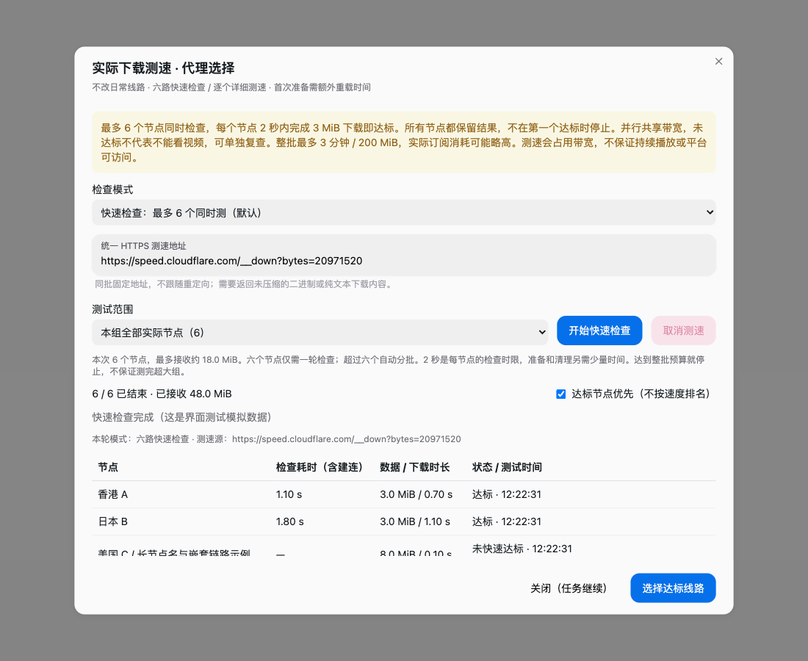

# clashB

**clashB** 是一个以 macOS 为主要验证平台的 Mihomo 代理客户端二次开发版本。

它保留订阅导入、代理组切换、系统代理和 Mihomo 内核管理等能力，并增加两种真实下载检查：

- **快速检查**：最多同时检查 6 个节点，快速判断线路是否达到视频使用的基本下载门槛。
- **详细测速**：逐个节点下载测试，显示速度并支持按速度排序。

> clashB 不是 Clash Party 官方发行版。项目基于 [Clash Party](https://github.com/mihomo-party-org/clash-party) 和 [Mihomo](https://github.com/MetaCubeX/mihomo) 二次开发。



## 当前状态

- 当前版本：`0.1.0`
- 主要验证平台：macOS Apple Silicon
- macOS 构建目标：`.pkg` 和 `.dmg`
- 自动更新：暂未启用，请从本项目 GitHub Release 手动下载新版本
- Windows/Linux：保留现有构建配置，但当前版本不把它们作为已完成的端到端验证目标
- 未签名构建：首次打开可能需要在 macOS 的“系统设置 → 隐私与安全性”中允许打开

## 普通用户使用方法

### 1. 获取应用

从 GitHub Release 下载对应架构的 macOS 安装包：

- Apple Silicon：`arm64`
- Intel Mac：`x64`

一般用户优先下载 `.dmg`；需要标准安装流程时下载 `.pkg`。

如果项目还没有发布 Release，可以先按[开发者构建](#开发者构建)生成本地 App。当前自动更新已关闭，不会从上游 Clash Party 自动下载更新。

### 2. 首次启动

1. 打开 `clashB.dmg`，将 `clashB.app` 拖到“应用程序”，或运行 `.pkg` 安装包。
2. 启动 clashB。
3. 如果 macOS 阻止打开：打开“系统设置 → 隐私与安全性”，点击“仍要打开”，然后重新启动。
4. 如果你启用了 TUN 或系统代理功能，按 macOS 提示允许相关权限。

未签名版本可能出现一次安全提示，这是开发版的正常现象；不要从不明来源下载安装包。

### 3. 导入订阅

你需要一个 **Mihomo / Clash 格式的订阅链接**。订阅链接通常包含账号凭据，不要公开发布、提交到 GitHub 或发到 Issue。

在应用中：

1. 打开“配置 / 订阅”页面。
2. 点击添加远程订阅。
3. 粘贴订阅链接。
4. 保存并更新订阅。
5. 进入“代理”页面，确认代理组和节点已经出现。

如果订阅更新需要经过代理，可以先使用已有可用配置，或在订阅设置中启用“通过代理更新”。刚导入订阅但没有代理连接时，不要强制通过一个尚未验证的代理更新它。

### 4. 连接代理

1. 在“代理”页面展开一个代理组。
2. 点击一个节点，确认该代理组显示当前选中节点。
3. 根据需要打开系统代理；如果使用 TUN，先确认 Mihomo 内核已经启动。
4. 先用普通网页或 IP 检查确认代理连接正常，再进行下载检查。

测速不会自动切换你的日常代理组。测速下载会占用本机和订阅带宽，建议在不看视频、不进行大文件下载时运行。

## 下载检查怎么用

### 快速检查（默认）

适合你的目标是“找一条够看视频的线路”，而不是精确比较每条线路的理论峰值。

1. 在“代理”页面点击目标代理组旁的 **下载测速**。
2. 保持检查模式为 **快速检查：最多 6 个同时测**。
3. 测试范围选择 **本组全部实际节点**，或只选择一个节点。
4. 点击 **开始快速检查**。
5. 等待所有节点显示结果。
6. 如果有“达标”节点，点击 **选择达标线路**；没有达标节点时，可以选择一个节点单独复查，或切换到详细测速。

快速检查的规则：

- 最多 6 个节点同时下载。
- 每节点最多 2 秒、3 MiB。
- 在 2 秒内收到 3 MiB 才显示“达标”。
- 六个节点会全部保留结果，不会找到第一个达标节点后立即停止。
- 并发下载会共享本机和上游带宽；“未快速达标”只代表这次并发检查没有通过，不等于该节点一定不能看视频。
- 快速模式不按下载速度排名，避免把带宽竞争结果误认为节点独立速度。

### 详细测速

适合你希望比较节点速度，或者快速检查没有得到明确结果时使用。

1. 将检查模式改为 **详细测速：逐个测，比较速度**。
2. 选择全部节点或单个节点。
3. 点击 **开始下载测速**。
4. 等待结果，使用“按有效下载速度降序”查看排名。
5. 点击 **切换到本轮已测最快**，只切换本次测试的目标代理组。

详细模式规则：

- 串行测试，一次只测一个节点。
- 每节点最多 5 秒或 20 MiB。
- 整批最多 3 分钟或 200 MiB。
- 失败、取消、样本不足的结果不参与最快选择。
- 速度表示到统一测速源的本次下载表现，不是节点永久带宽保证。

### 取消测速

点击 **取消测速** 会停止当前任务和后续节点。关闭窗口不会取消任务，重新打开“下载测速”可以查看主进程中保存的任务状态。

配置重载、订阅更新、内核停止或退出时，旧测速结果会失效，避免把旧节点结果应用到新配置。

### 为什么测速不会直连？

每个测速任务通过独立的本地入口和 Mihomo 选择组发送下载请求：

- 每个并发节点有独立测速入口，不会共用一个不断切换的代理选择组。
- 下载建立显式 HTTP CONNECT，并校验 HTTPS 证书。
- 节点选择后会向 Mihomo 读回确认。
- 节点失败时不会回退到直连或其他节点。
- 测试结束会清理该测速入口产生的连接。

## 常见问题

### 为什么所有节点都“未快速达标”？

快速模式是并发检查，六条线路会共享带宽；它不是每条线路的独立速度测试。可以：

- 选一个节点单独快速检查；或
- 使用详细测速逐个测试；或
- 在网络空闲时重新检查。

### 为什么测速后日常线路没有变化？

这是设计行为。测速完成只显示结果，不会自动改变日常线路。必须点击“选择达标线路”或“切换到本轮已测最快”才会切换目标代理组。

### 为什么无法选择最快节点？

自动选择组、嵌套组或配置刚刚发生变化时，应用可能拒绝快捷切换。这是为了避免偷偷修改其他规则共享的代理组。请打开对应的手动选择组后再测试。

### 测试流量和订阅账单流量一样吗？

不完全一样。应用统计接收到的响应体数据，但 TLS、代理协议、重传和在途数据会带来额外消耗。时间和流量限制是保护措施，不是运营商账单的绝对硬上限。

## 开发者构建

### 环境

- macOS（当前主要验证平台）
- Node.js 22 或项目工具链兼容版本
- pnpm 11
- Git
- Xcode Command Line Tools

### 安装与启动

```sh
git clone git@github.com:StevenLiuShiqi/clashB.git
cd clashB
pnpm install --frozen-lockfile
pnpm dev
```

安装脚本会准备 Electron 原生依赖和 Mihomo sidecar。需要手动准备资源时：

```sh
pnpm run prepare
```

不要手工编辑 `pnpm-lock.yaml`、`extra/sidecar/` 或 `node_modules/.temp/`。

### 构建 macOS App

```sh
pnpm build:mac
```

构建配置会生成：

```text
dist/clashB-macos-0.1.0-arm64.dmg
dist/clashB-macos-0.1.0-arm64.pkg
```

Intel Mac 对应架构为 `x64`。未配置 Apple Developer 签名和公证时，构建产物可以用于本机测试，但不适合作为面向普通用户的正式安装包。

### 质量检查

```sh
pnpm run format:check
pnpm run lint:check
pnpm run typecheck
pnpm test
```

实际 Mihomo 集成测试默认跳过；使用独立测试内核时：

```sh
MIHOMO_TEST_BINARY=/absolute/path/to/mihomo pnpm exec vitest run src/main/speedtest/mihomo.integration.test.ts
```

集成测试只使用本机临时代理和 HTTPS 服务，不读取个人订阅、不启用 TUN、不修改系统代理。

## 仓库结构

```text
src/
  main/
    config/       应用配置、订阅、覆写
    core/         Mihomo 生命周期、API、配置生成
    speedtest/    下载检查领域模块
    resolve/      窗口、托盘、插件等应用服务
    sys/          系统代理和系统能力
    traffic/      流量记录和监控
    utils/        通用工具
  preload/        Electron preload 与 IPC 白名单
  renderer/src/   React 页面、组件、hooks 和 UI 工具
  shared/         主进程与渲染进程共用类型

docs/             面向用户和开发者的公开文档
build/            图标、macOS helper、安装脚本
scripts/          准备资源、构建、版本和发布辅助脚本
.github/workflows/ CI 与多平台构建流程
electron-builder.yml  App、pkg、dmg 打包配置
```

测速模块尽量保持独立：下载器、任务调度、Mihomo 适配、连接清理、纯策略和 UI 分开，后续增加测速源、视频门槛或新的筛选策略时，不需要改动订阅导入和普通节点切换核心。

## 隐私与安全

不要把订阅 URL、节点密码、真实配置或未脱敏截图提交到 GitHub。测试订阅应写入权限受限的临时文件，测试结束后删除。

clashB 当前关闭自动更新；发布新版本时需要从本项目 GitHub Release 手动下载。未来配置自有 Release feed 后，再单独开启自动更新。

## 上游与许可证

- [Clash Party](https://github.com/mihomo-party-org/clash-party)
- [Mihomo](https://github.com/MetaCubeX/mihomo)

本项目是二次开发版本，不是上游官方发行版。许可证见 [LICENSE](LICENSE)（GPL-3.0）；第三方依赖遵循各自许可证。
